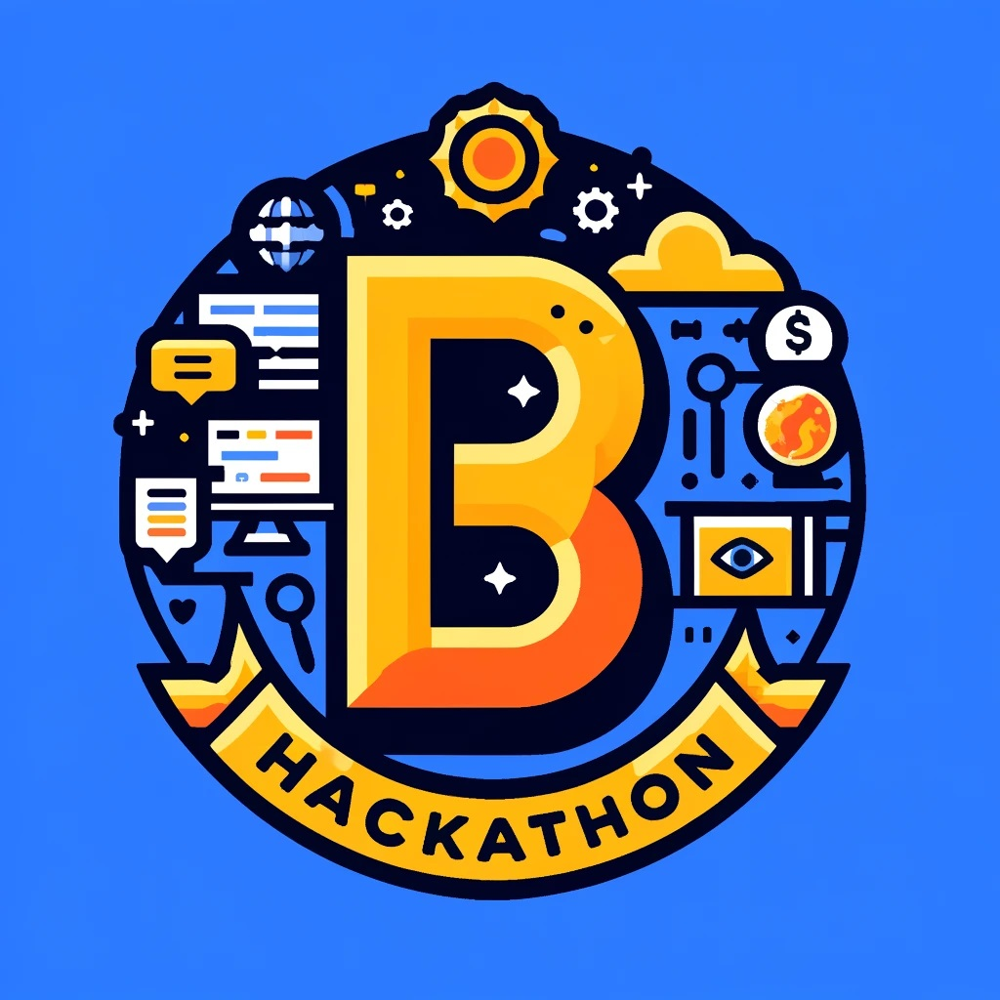

# hackathon-2024
Hackathon organized at IMD/UFRN in Natal from 01/07/2024 to 05/07/2024.

## Organization
This hackathon is organized over 5 consecutive days.
It will address B modelling and be the occasion to assess:
- modelling skills using mathematical predicates
  - specification: how to transform a text in natural language into a formal model,
  - implementation: knowledge of the B0 principles (only deterministic substitutions and implementable types),
- understanding of the whole process:
  - ability to trigger typecheck, proof obligation generation, automatic provers
  - ability to correct a model
  - understanding of what a proof obligation is and to check visualy if it is true or false.

Students can participate alone or in a group, as they wish.
During the first day, an introduction to the hackathon will be done, explaining what is expected and how the results are going to be evaluated. Every day a new subject will be proposed on this github, with initial B models and directions, to address and solve different issues / problems.
Students are entitled/invited to contribute to each subject (improvement, refactoring, etc.)  until the last day.
Questions can be asked during the duration of the hackathon but also by email between sessions (to thierry.lecomte@clearsy.com). The answers to these email questions will be shared on this github. Please refer to it often.  

A final report has to be sent to thierry.lecomte@clearsy.com during the last session on Friday 5th.
This report (free format) should contain the name of the author(s) and for each subject:
- the answer to the questions,
- the B models developped, as listings,
- a screenshot of the proof status, from Atelier B,
- any justification you consider useful for understanding . 

Based on this report and solely on this report, a score will be given to each report. 
The author(s) of the report with the highest score will receive a new laptop (15,6" FHD, 16Go RAM, 512Go SSD, Windows 11), a wired mouse, and a bag.
In case of ex-aequos, additional criteria will be used in descending order: 
1) automatic rate of proof (quantitative criterion),
2) interest and usefulness of explanations (qualitative criterion). 

## Contents
This site contains some resources used for the Hackathon:
- models used to bootstrap subjects (to come - updated every day during the hackathon)
- pdfs of the slides presented (to come - updated every day during the hackathon)

Required modelling tools are:
- [Atelier B](https://www.atelierb.eu/en/atelier-b-support-maintenance/download-atelier-b/)  (Atelier B 24.04 CLEARSY Safety Platform)
- [ProB](https://prob.hhu.de/w/index.php?title=Installation) (zip + third-party installers)

